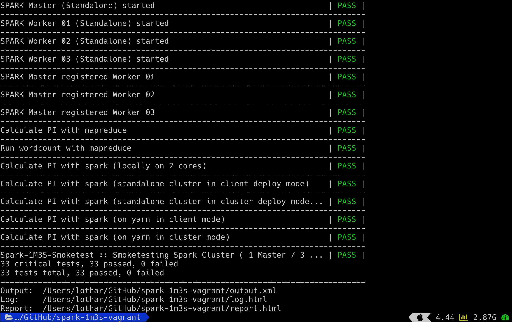

# Hadoop 3.2.0 + Spark 2.4.0


| **Component** | **Version** |
|---|---|
| **Hadoop** Release **3.2.0** available | 2019 Jan 16 |
| Hadoop Release 2.9.2 available         | 2018 Nov 19 |
| Hadoop Release 3.1.1 available         | 2018 Aug 8 |
| Hadoop Release 3.0.3 available         | 2018 May 31 |

| **Component** | **Version** |
|---|---|
| **Spark** Release **2.4.0** available  | 2018 Nov 2 |

## Content

In case you want a small and local cluster providing

Hadoop + Spark ~~+ Flink~~

you might give this one a try.

## Prerequisites

| **Component** | **Version** |
|---|---|
| [Vagrant](https://www.vagrantup.com) | tested with 2.2.3 |
| [VirtualBox](http://virtualbox.org) | tested with 6.0.4 |
| [Ansible](http://docs.ansible.com/ansible/index.html) | tested with 2.7.8 |
| [Robot Framework](https://robotframework.org) | tested with 3.0.4 |

:warning: Vagrant might ask for an admin password as the vagrant plugin  The reason behind is, that
`vagrant-hostmanager` edits __/etc/hosts__ to make the vms available with their hostnamesnames in the network.

## Init

```bash
git clone https://github.com/lwieske/spark-1m3s-vagrant.git
cd spark-1m3s-vagrant
vagrant up
```

or you can run a test suite with the robot framework.

```bash
git clone https://github.com/lwieske/spark-1m3s-vagrant.git
cd spark-1m3s-vagrant
robot spark-1m3s-smoketest.robot
```



## Cluster Coordinates

#### Masters + Slaves

| IP | Hostname | Description | Settings |
|:--- |:-- |:-- |:-- |
|10.10.10.101 | master   | hdfs namenode + yarn resourcemanager + spark master | 1024 MB RAM |
|10.10.10.201 | slave-01 | hdfs datanode + yarn nodemanager     + spark worker | 2048 MB RAM |
|10.10.10.202 | slave-02 | hdfs datanode + yarn nodemanager     + spark worker | 2048 MB RAM |
|10.10.10.203 | slave-03 | hdfs datanode + yarn nodemanager     + spark worker | 2048 MB RAM |

### Connections

|| Master | Slave 01 | Slave 02 | Slave 03 |
|:---:|:---:|:---:|:---:|:---:|
| **SPARK** | Standalone Master <br> [Web UI HTTP](http://master:8080) | Standalone Slave 01 <br> [Web UI HTTP](http://slave-01:8081) | Standalone Slave 02 <br> [Web UI HTTP](http://slave-01:8081) | Standalone Slave 03 <br> [Web UI HTTP](http://slave-01:8081) |
| **YARN** | ResourceManager <br> [Web UI HTTP](http://master:8088/cluster) | NodeManager 01 <br> [Web UI HTTP](http://slave-01:8042/node) | NodeManager 02 <br> [Web UI HTTP](http://slave-02:8042/node) | NodeManager 03 <br> [Web UI HTTP](http://slave-03:8042/node) |
| **HDFS** | NameNode <br> [Web UI HTTP](http://master:9870/dfshealth.html#tab-overview) | DataNode 01 <br> [Web UI HTTP](http://slave-01:9864/datanode.html#tab-overview) | DataNode 02 <br> [Web UI HTTP](http://slave-02:9864/datanode.html#tab-overview) | DataNode 03 <br> [Web UI HTTP](http://slave-02:9864/datanode.html#tab-overview) |

#### MRV2

[MRV2 history / Web UI HTTP](http://master:19888/jobhistory)

#### SPARK

[SPARK history / Web UI HTTP](http://master:19888/jobhistory)


# Usage

## Further Links

	* [yarn-default.xml](https://hadoop.apache.org/docs/r3.1.1/hadoop-yarn/hadoop-yarn-common/yarn-default.xml)
	* [core-default.xml](https://hadoop.apache.org/docs/r3.1.1/hadoop-project-dist/hadoop-common/core-default.xml)
	* [hdfs-default.xml](https://hadoop.apache.org/docs/r3.1.1/hadoop-project-dist/hadoop-hdfs/hdfs-default.xml)
	* [Spark Documentation](https://spark.apache.org/docs/latest/)
	* [Apache Cassandra Documentation](http://cassandra.apache.org/doc/latest/)
